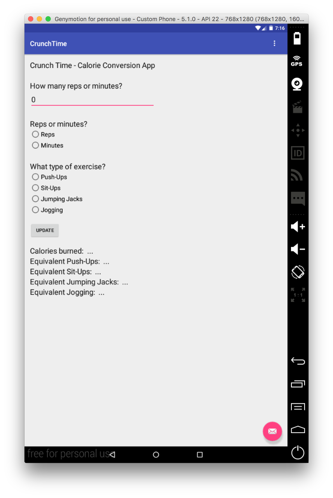
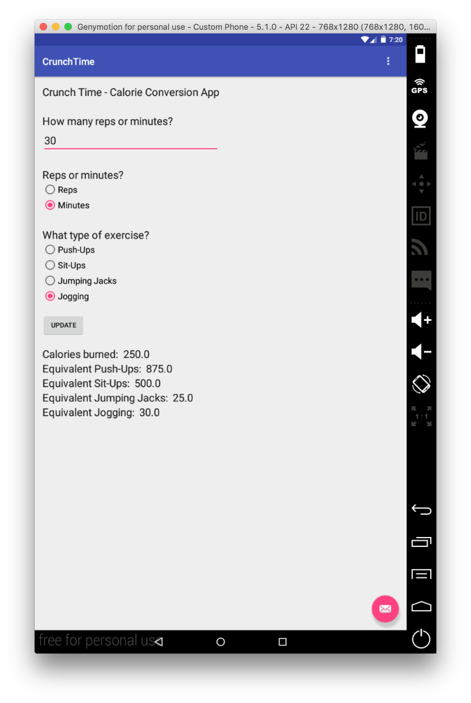
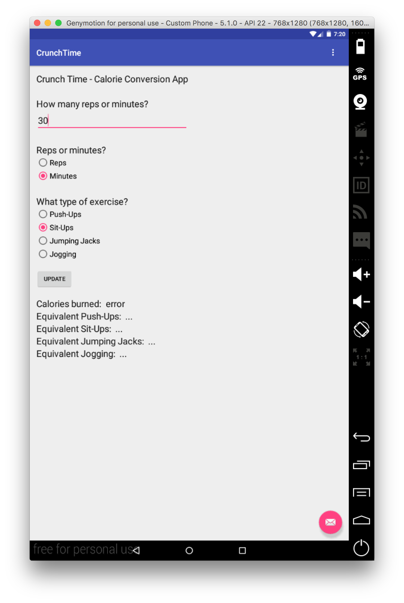

# PROG 01: Crunch Time

My app implements a simple calorie converter, allowing the user to select a type of exercise and enter an amount in reps or minutes. It calculates the amount of calories burned, as well as the equivalent amount of the other listed types of exercise.

## Authors

Casey Currey-Wilson ([currey-wilsonc@berkeley.edu](mailto:currey-wilsonc@berkeley.edu))

## Demo Video

See [Crunch Time Demo - Casey Currey-Wilson] (https://www.youtube.com/watch?v=G86t5PGFFH8)

## Screenshots

## Acknowledgments

